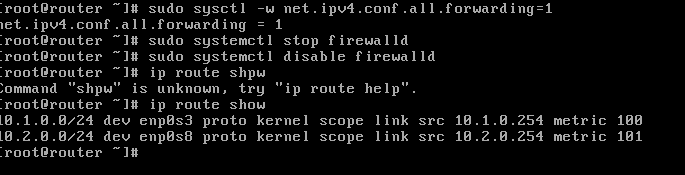

# B1-reseau-tp4

# I.Mise en place du lab

## 1.Création des réseaux

On crée les deux cartes réseaux sur VirtualBox en faisant fichier, host network manager, on crée deux cartes réseaux et on met les IP des cartes réseau suivantes :
* `10.1.0.1`  
* `10.2.0.1`  

On ne met pas de DHCP.

## 2.Création des VMs

Pour crée les clones du patron on fait un clique droit sur le patron et on fait "cloner".
Les trois clones ont une carte réseau avec une adresse IP différentes :
* `client1.tp4` a une adresse IP de `10.1.0.10`, elle servira de client (dans `net1`).
* `server1.tp4` a une adresse IP de `10.2.0.10`, elle servira de serveur (dans `net2`).
* `router1.tp4` a une adresse IP de `10.1.0.254` dans `net1` et une adresse IP de `10.2.0.254` dans `net2`, cette machine sera notre routeur, ce sera la passerelle de `client1` et `server1`

### Checklist
* On définie les IP statiques de la VM client, serveur et routeur.
* La connexion SSH est fonctionnel sur les trois VM.  
* On change le nom de domaine de chaque VM en faisant la commande `echo 'nom de la VM' | sudo tee /etc/hostname`.  
* Après avoir fait le remplissage des fichier `/etc/host` la VM client peut ping le routeur net 1 et la VM serveur peut ping le routeur net 2.

## 3.Mise en place du routage statique 

